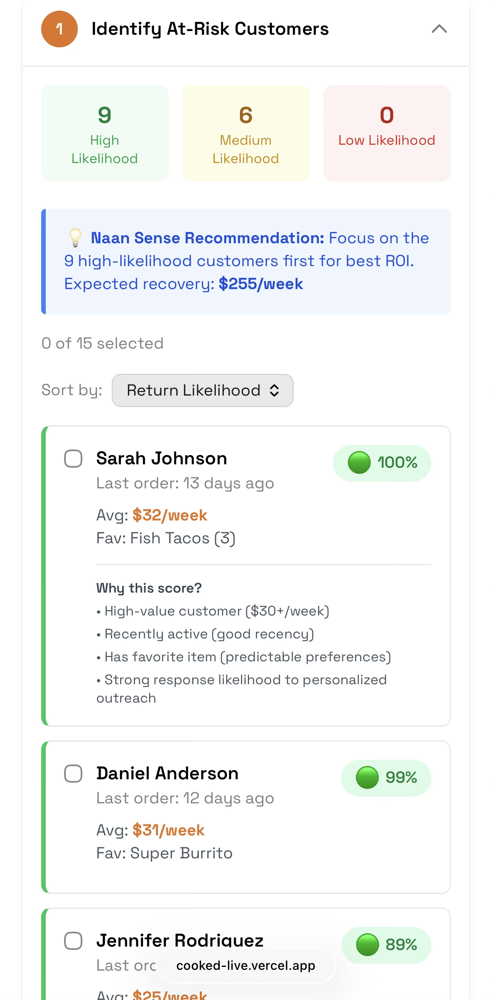

# We Cook When You're Cooked

> **The Challenge**: Most analytics platforms show you what's happening, but leave you to figure out "so what?" and "now what?"
> **The Insight**: Users will pay 5-10x more for "insights + judgment + execution" than for "insights alone."
> **This Prototype**: Explores how conversational AI transforms analytics from dashboards → strategic partners.

**[Live Demo](https://cooked-live.vercel.app/)** | AI-powered customer retention with freemium monetization



---

## What This Demonstrates

**Product Thinking**
- Freemium monetization (alert system free, conversational AI premium)
- MVP discipline (validate core value before adding complexity)
- Discovery & adoption strategy (how operators find and use AI tools)

**Technical Execution**
- ML-powered customer scoring (🟢 high/🟡 medium/🔴 low likelihood to return)
- Mobile-first responsive design (375px → 1440px)
- Cost-conscious architecture (~$0.10-0.30 per conversation at $49/month)

**Business Impact**
- Productivity: 3 hours → 10 minutes per week (with conversational layer)
- Decision quality: Prioritize high-likelihood customers, benchmark-driven recommendations
- Monetization: $49/month replaces $50-100k/year data analyst hire

---

## Core Features

1. **Intelligent Retention Alerts** - Identifies 15 at-risk customers ($450/week), explains why they're leaving, recommends action, projects $240/week recovery

2. **ML-Powered Prioritization** - Scores each customer (🟢 82%, 🟡 54%, 🔴 38%), shows reasoning on hover, recommends "Focus on these 8 first"

3. **Revenue Recovery Projections** - Interactive 4-week chart (current path vs with action), clear ROI (19.6x return)

4. **Premium Conversion Flow** - Free tier (alert + tip) → Premium ($49/month for analysis + execution + tracking)

---

## What's Next: Conversational Intelligence

**The Vision**: Transform from alert system → strategic partner through conversation.

**Example interaction:**
```
User: "Why are these customers not returning?"

AI: "12 were lunch regulars (Mon-Wed, 11:30-1pm). They stopped 3 weeks
ago when menu pricing changed. The other 3 show no clear pattern."

User: "What's the best way to bring back the lunch crowd?"

AI: "Two approaches:
1. Quick test: Lunch promotion (15-20% recovery in 2 weeks)
2. Research-first: Survey them first (higher effort, builds loyalty)

Which interests you?"

User: "Let's try the survey"

AI: [Generates 12 personalized surveys] "Ready to send. I'll follow up
in 48 hours with results and next steps."
```

**Why this unlocks premium**: Users don't pay for alerts—they pay for **judgment on demand**. Personalized, interactive, executable, irreplaceable.

**Business model**: $49-99/month captures 1-2% of the $50-100k/year alternative (hiring a data analyst).

<details>
<summary><strong>📐 Technical Architecture & Scale Considerations</strong></summary>

### System Flow
```
User Question → Context Assembly → Claude Sonnet 4.5 → Response Parsing → Action Buttons
```

### Why This Scales
Built data platforms processing **50M+ events/day**—designed this with production constraints:

- **Context injection**: Dynamic loading (only relevant data per question) avoids token limits
- **Cost optimization**: $0.10-0.30/conversation = sustainable at $49/month
- **Action abstraction**: Separates intelligence from execution (enables async processing)

### Key Decisions

**Context Window Management**
- Problem: Full business history exceeds token limits
- Solution: Selective inclusion based on question keywords
- Cost: ~$0.10-0.30 per conversation

**Action Detection**
```javascript
const actions = {
  'send_message': (recipients, content) => triggerMessaging(),
  'fetch_data': (query) => queryDatabase(),
  'create_campaign': (params) => initiateCampaign()
};

// User confirms before execution
if (detectedAction) {
  showConfirmationButton(() => actions[actionType](params));
}
```

**Safety Constraints**
- Domain-restricted: Operational advice only (no financial/legal/HR)
- Fact-checked: Validate claims against actual data
- User-confirmed: All actions require explicit approval
- Graceful degradation: Handle uncertainty without breaking trust

</details>

<details>
<summary><strong>🧪 Experiment Design & Instrumentation</strong></summary>

### Hypothesis
Conversational AI increases:
- Premium conversion: 2x faster (7 days vs 14 days)
- Engagement: 3x frequency (daily vs 2-3x/week)
- Satisfaction: NPS +20 points

### Test Structure
- **Control**: Alert-only (current implementation)
- **Treatment**: Alert + conversational AI

### Success Criteria
- ≥30% lift in conversion rate
- ≥50% ask ≥1 question/week
- API costs <10% of revenue ($5 COGS on $49 price)
- ≥2 hours/week time savings

### Instrumentation
Based on scaling analytics platforms from 200→500 users:

**Awareness**: `alert_viewed`, `alert_dismissed`
**Engagement**: `premium_modal_opened`, `feature_explanation_viewed`
**Conversion**: `trial_started`, `first_action_taken`
**Retention**: `return_visit`, `chat_question_asked`

*Can't optimize what you don't measure—instrumentation design is as critical as feature design.*

</details>

<details>
<summary><strong>🎯 Discovery & Adoption Strategy</strong></summary>

### The Challenge
Operators won't use tools they don't discover or understand.

### Approach

**In-Context Triggers**
Show alerts when operators are already looking at related data ("Viewing this week's sales? Here's what the AI noticed...")

**Progressive Disclosure**
Week 1: Retention alerts | Week 2: Revenue insights | Week 3: Conversational layer

**Community Proof Points**
"3 similar taco stands recovered $500+ using this feature"

**Quick Wins First**
First alert = actionable today, track time-to-first-action (<5 min goal)

</details>

<details>
<summary><strong>🔧 The Hard Problems I'd Focus On</strong></summary>

**Context Relevance**
How much history does AI need? When is real-time data vs historical patterns needed?

**Trust & Transparency**
What makes users trust AI enough to execute? Show confidence levels or explain reasoning?

**Conversation vs Shortcuts**
When does chat add value vs create friction? Balance flexibility with speed.

**Third-Party Partnerships**
- Need external data for benchmarking, SMS/email providers, POS integrations
- How to make 3P connections feel native?
- Absorb costs or pass through?
- Example: "50% of at-risk customers are loyalty members—issue is relevance, not incentives"

**Multi-Entity Complexity**
How does this scale for operators managing multiple locations?

**Learning & Personalization**
How do we learn from past decisions? Adapt communication style? Balance personalization with quality?

</details>

<details>
<summary><strong>💡 Key Learnings</strong></summary>

**The hard part isn't the AI**—it's figuring out which questions users want answered and making advice executable.

**Context matters more than model quality**—Smaller model + perfect context > larger model + generic knowledge.

**Users don't want conversation for its own sake**—They want speed. Chat is valuable when questions are unique/complex.

**Freemium needs clear aha→necessity progression**—Alerts = aha moment. Conversation = can't live without.

**MVP discipline is critical**—Could've built chat first (more impressive), but validating core value first was the right product decision.

</details>

<details>
<summary><strong>🤔 Open Questions</strong></summary>

- **Conversation memory**: Session-based vs persistent?
- **Proactive vs reactive**: Should AI initiate conversations ("I noticed...") or only respond?
- **Multi-modal interaction**: When do visualizations communicate better than text?
- **Personalization depth**: How much should AI adapt to individual users?
- **Failure modes**: Graceful degradation when AI doesn't know the answer?

</details>

---

## Tech Stack

React 19 • Vite • Tailwind CSS • Recharts • Space Grotesk typography

**Design System**: Spice Orange (#E37222), Royal Purple (#7B3FF2), Hunter Green (#4A9B5E)

---

## Quick Start

```bash
npm install
npm run dev
```

**Deploy**: Push to GitHub → Connect to Vercel → Auto-deploy

---

## What Makes This Intelligence Different

| Basic (Competitors) | Advanced (This Approach) |
|---------------------|-------------------------|
| "Your sales are down" | "12 lunch regulars stopped when you changed pricing 3 weeks ago" |
| "Try a promotion" | "Quick test: Promotion (2 weeks) vs Research-first: Survey (4 weeks, higher loyalty). Which fits your timeline?" |
| "15 customers at risk" | "Generate 15 personalized messages → Send with one click → Auto-follow-up in 48 hours" |

**The differentiation**: Detect → Diagnose → Prescribe → Execute

---

**Feedback welcome** | A prototype exploring AI product monetization for SMB analytics | [MIT License](LICENSE)
